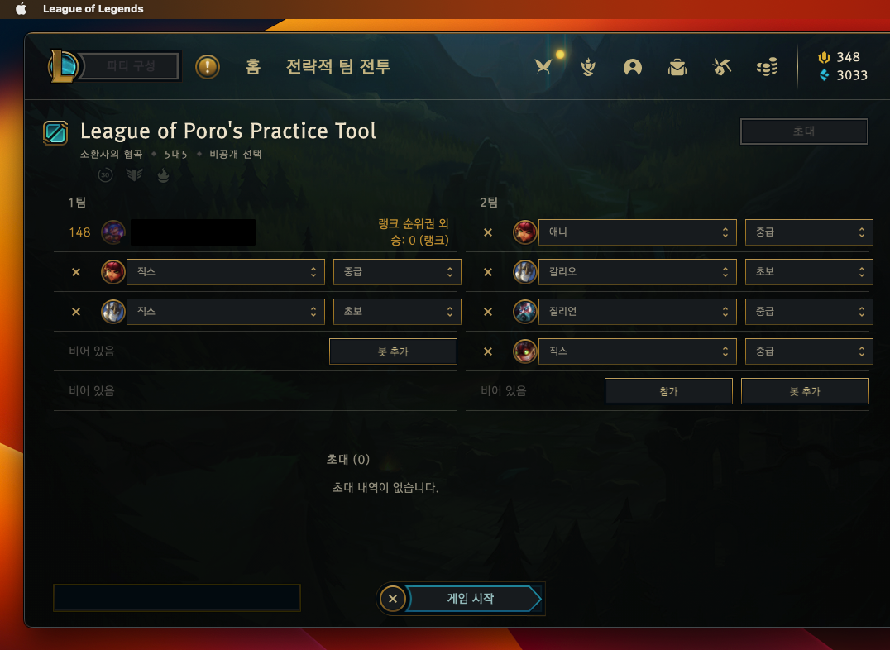

# PoroLobby in MAC

## install first

Please Open a terminal and execute this command.

- [homebrew instal](https://brew.sh/)

```bash
/bin/bash -c "$(curl -fsSL https://raw.githubusercontent.com/Homebrew/install/HEAD/install.sh)"
```

- **python3.10** verseion or later.

```bash
brew install python3
```

- pip3
- pipenv

```bash
sudo -H pip3 install pipenv
```


## Run script

```bash
./start_macos.sh
```

